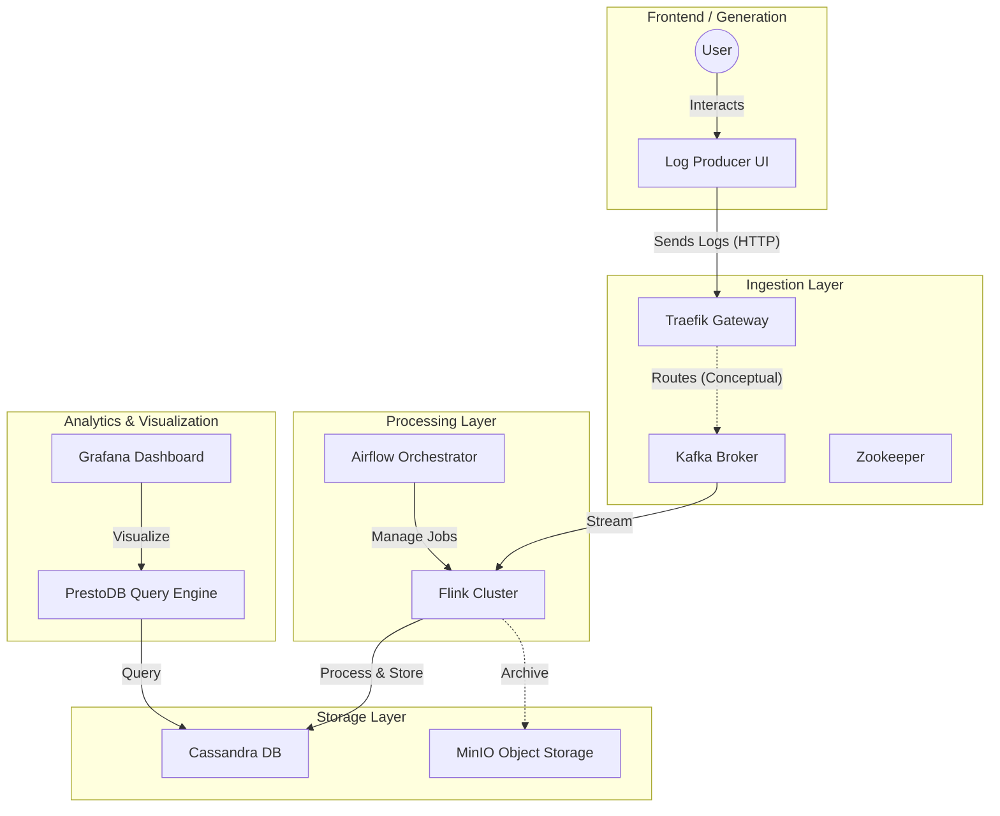

# Event Log Demo Project

An interactive demonstration of a modern event streaming pipeline with observable data flow, component lifecycle control, and failure scenario testing. This project showcases resilience patterns in distributed systems using Kafka, Flink, and Cassandra.

## 🎯 Key Features

- **Observable Data Flow**: Real-time metrics showing data flowing through Producer → Kafka → Flink → Cassandra
- **Component Control API**: Start/stop/pause any service to demonstrate queue buildup and recovery
- **Failure Drills**: Guided scenarios to explore backpressure, buffering, and resilience patterns
- **Non-blocking Monitoring**: Background scheduler refreshes metrics every 10 seconds
- **Production-Ready Patterns**: Defensive coding, pure functions, comprehensive test coverage
- **🆕 Clean Code Refactored**: OWASP Top 10 & SonarQube compliant (see [REFACTORING_COMPLETE.md](./REFACTORING_COMPLETE.md))

## 🔒 Security & Code Quality

This project has been refactored according to **Clean Developer** principles:

- ✅ **OWASP A03**: Input validation with value objects (injection prevention)
- ✅ **OWASP A05**: No hardcoded credentials (all config from environment)
- ✅ **OWASP A09**: Secure logging (no sensitive data exposure)
- ✅ **SonarQube**: Cyclomatic complexity < 5, no magic numbers, no code duplication
- ✅ **Clean Code**: Single Responsibility, pure functions, immutable config
- ✅ **55+ Tests**: Unit, integration, and security boundary tests

**📚 Documentation:**
- [Complete Refactoring Report](./REFACTORING_COMPLETE.md) - Detailed before/after analysis
- [Clean Code Quick Reference](./CLEAN_CODE_GUIDE.md) - Security checklist & environment variables
- [Producer Refactoring Notes](./components/producer/REFACTORING_NOTES.md) - Integration guide

## Architecture

The system is designed to handle high-throughput log ingestion, processing, and storage.



### Component Description

**Core Pipeline:**
- **Log Producer** (Flask/Python): Generates synthetic log events at configurable rate and size. Provides control API for component lifecycle management.
- **Traefik**: Edge router acting as ingestion gateway (conceptual routing in this demo).
- **Kafka**: Distributed streaming platform - buffers events and decouples producers from consumers.
- **Flink**: Stream processing framework - reads from Kafka, processes logs, writes to Cassandra.
- **Cassandra**: Wide-column NoSQL database for high-throughput log storage.

**Supporting Services:**
- **Zookeeper**: Kafka cluster coordination.
- **Presto**: Distributed SQL query engine for analytics on Cassandra data.
- **Grafana**: Visualization dashboards for metrics and log data.
- **MinIO**: S3-compatible object storage for data archival.
- **Airflow**: Workflow orchestration (conceptual job management).

## Data Flow Explanation

```
Producer (count: N)  →  Kafka (offset: M)  →  Flink  →  Cassandra (records: P)
```

**Metrics:**
- `producer_count`: Total logs generated by producer application
- `kafka_count`: Kafka topic end offset (total messages received)
- `cassandra_count`: Total records persisted in Cassandra database
- `is_streaming`: Boolean indicating active log generation

**Normal Operation:** N ≈ M ≈ P (all metrics grow together)

**Queue Buildup:** When a component fails:
- Flink down: M continues growing, P stays static (Kafka buffering)
- Kafka down: N continues growing, M/P static (Producer buffering)
- Cassandra down: N/M grow, P static (Flink buffering writes)

## Prerequisites

- **Docker Desktop**: Ensure Docker and Docker Compose are installed and running
- **Resources**: Allocate at least 8GB RAM to Docker for running all services
- **Ports**: Ensure these ports are available: 5000 (Producer), 8080 (Traefik), 8081 (Flink), 3000 (Grafana), 9042 (Cassandra)

## Quick Start

1. **Clone and navigate to the project**:
   ```bash
   cd event-log-demo
   ```

2. **Start all services**:
   ```bash
   docker compose up -d --build
   ```
   *First run takes 5-10 minutes to download images and install Docker CLI in producer container.*

3. **Wait for services to initialize** (~2 minutes):
   ```bash
   docker compose ps
   ```
   Verify all containers are "Up" or "running".

4. **Access the Producer UI**:
   Open [http://localhost:5000](http://localhost:5000)

5. **Start log streaming**:
   ```bash
   curl -X POST -H "Content-Type: application/json" \
     -d '{"size_kb": 1, "rate": 10}' \
     http://localhost:5000/start
   ```

6. **Monitor metrics** (refreshes every 10 seconds):
   ```bash
   curl http://localhost:5000/monitor
   ```
   
   Expected output:
   ```json
   {
     "producer_count": 150,
     "kafka_count": 150,
     "cassandra_count": 145,
     "is_streaming": true
   }
   ```

## User Guide

### Producer UI (http://localhost:5000)

The web interface provides manual control over log generation:

- **Log Size**: Set size of each log message (KB)
- **Rate**: Set generation rate (logs per second)
- **Send Logs**: Start streaming with specified parameters
- **Stop**: Pause log generation (metrics stop changing)

### Control API for Component Lifecycle

Control any service programmatically:

**Stop a service:**
```bash
curl -X POST http://localhost:5000/control/kafka/stop
curl -X POST http://localhost:5000/control/flink/stop
curl -X POST http://localhost:5000/control/cassandra/stop
```

**Start a service:**
```bash
curl -X POST http://localhost:5000/control/kafka/start
```

**Restart a service:**
```bash
curl -X POST http://localhost:5000/control/kafka/restart
```

**Check service status:**
```bash
curl http://localhost:5000/control/kafka/status
```

### Monitoring Dashboard Endpoints

Access component-specific dashboards:

- **Metrics API**: [http://localhost:5000/monitor](http://localhost:5000/monitor) - Real-time pipeline metrics (JSON)
- **Traefik Dashboard**: [http://localhost:8080](http://localhost:8080) - Routing and request metrics
- **Flink Dashboard**: [http://localhost:8081](http://localhost:8081) - Stream processing jobs
- **Grafana**: [http://localhost:3000](http://localhost:3000) - Visualization (admin/admin)
- **MinIO Console**: [http://localhost:9001](http://localhost:9001) - Object storage (minioadmin/minioadmin)
- **Presto UI**: [http://localhost:8085](http://localhost:8085) - Query engine status

### Disk Utilization Monitoring

**Check Kafka disk usage:**
```bash
docker exec event-log-demo-kafka-1 du -sh /var/lib/kafka/data
```

**Check Cassandra disk usage:**
```bash
docker exec event-log-demo-cassandra-1 du -sh /var/lib/cassandra/data
```

**Expected growth** (at 10 logs/sec, 1KB each):
- Kafka: ~10 MB/min
- Cassandra: ~8 MB/min (with compression)
- Kafka auto-cleanup after 7 days (default retention)

## Failure Scenario Drills

Explore resilience patterns with guided failure scenarios. See detailed walkthrough in [scripts/demo/FAILURE_DRILLS.md](scripts/demo/FAILURE_DRILLS.md).

### Quick Example: Kafka Failure Drill

1. **Baseline** - Start streaming:
   ```bash
   curl -X POST -H "Content-Type: application/json" \
     -d '{"size_kb": 1, "rate": 10}' http://localhost:5000/start
   ```

2. **Observe normal flow** (all metrics growing together):
   ```bash
   curl http://localhost:5000/monitor
   ```

3. **Trigger failure** - Stop Kafka:
   ```bash
   curl -X POST http://localhost:5000/control/kafka/stop
   ```

4. **Observe queue buildup** (producer continues, Kafka static):
   ```bash
   # Run every 10 seconds and observe:
   # - producer_count increases (buffering in memory)
   # - kafka_count stays static (broker down)
   # - cassandra_count stays static (no new data)
   curl http://localhost:5000/monitor
   ```

5. **Trigger recovery** - Restart Kafka:
   ```bash
   curl -X POST http://localhost:5000/control/kafka/restart
   ```

6. **Observe recovery** (queued messages flush to Kafka):
   ```bash
   # kafka_count rapidly increases
   # cassandra_count resumes growing
   curl http://localhost:5000/monitor
   ```

### Available Drills

Run these scripts from `scripts/demo/`:

**Bash (Linux/Mac/Git Bash):**
- `./stop-kafka.sh` / `./restart-kafka.sh`
- `./stop-flink.sh` / `./restart-flink.sh`
- `./stop-cassandra.sh` / `./restart-cassandra.sh`
- `./pause-producer.sh` / `./resume-producer.sh`

**PowerShell (Windows):**
- `.\stop-kafka.ps1` / `.\restart-kafka.ps1`
- `.\stop-flink.ps1` / `.\restart-flink.ps1`

Each script explains expected behavior and monitoring steps.

## 🔥 Chaos Nurse (Demo Mode)

The Chaos Nurse is an automated chaos engineering component designed to create realistic failure scenarios during live demonstrations. It randomly stops, starts, and restarts services every ~10 seconds to showcase system resilience.

### Key Features

- **Automated Chaos**: Randomly targets services (Kafka, Flink, Cassandra) for disruption
- **UI Control**: Enable/disable chaos mode directly from the web interface
- **Safe Targets**: Only affects services that can safely handle restarts
- **Action History**: Tracks last 20 chaos actions with timestamps
- **Non-blocking**: Runs as background scheduler job every 10 seconds

### Using Chaos Nurse

**Enable via UI:**
1. Open [http://localhost:5000](http://localhost:5000)
2. Locate the "🔥 Chaos Nurse (Demo Mode)" panel
3. Click "Enable Chaos" button
4. Watch services automatically stop/start/restart
5. Observe queue buildup and recovery patterns

**Enable via API:**
```bash
# Enable chaos mode
curl -X POST http://localhost:5000/chaos/enable

# Disable chaos mode
curl -X POST http://localhost:5000/chaos/disable

# Check status
curl http://localhost:5000/chaos/status

# View action history
curl http://localhost:5000/chaos/history
```

**Example Output:**
```json
{
  "enabled": true,
  "history": [
    {"timestamp": "2024-01-15 14:23:45", "service": "kafka", "action": "restart"},
    {"timestamp": "2024-01-15 14:23:35", "service": "flink", "action": "stop"},
    {"timestamp": "2024-01-15 14:23:25", "service": "cassandra", "action": "start"}
  ]
}
```

### Targeted Services

The Chaos Nurse targets these components:
- `kafka` - Message broker (causes queue buildup when down)
- `flink` - Stream processor (causes processing lag)
- `cassandra` - Database (causes write buffering)
- `flink-taskmanager` - Flink worker nodes (tests task redistribution)

Services like Zookeeper, Traefik, and the Producer are excluded to maintain system operability.

### Demo Use Case

**Perfect for presentations:**
1. Start log streaming (10 logs/sec)
2. Enable Chaos Nurse
3. Display metrics dashboard
4. Watch automated failures trigger:
   - Queue buildup (Producer > Kafka > Cassandra metrics diverge)
   - Automatic recovery (metrics reconverge after restart)
   - Real-time visualization of resilience patterns

The Chaos Nurse creates a "living system" effect, making demonstrations more engaging and realistic without manual intervention.

## Development & Testing

### Run Unit Tests

```bash
docker compose --profile tests run --rm producer-tests pytest -v
```

**Test Coverage:**
- 6 tests: `metrics_collector.py` (provider pattern, error handling)
- 2 tests: scheduler and cache update logic
- 11 tests: `container_controller.py` (service lifecycle)
- 8 tests: control API endpoints (Flask routes)
- 18 tests: `chaos_nurse.py` (enable/disable, execution, history, thread-safety)

**Total: 45 tests** covering defensive coding, pure functions, thread-safety, and API contracts.

### Code Architecture

The producer follows clean code principles:

**Separation of Concerns:**
- `metrics_collector.py`: Pure functions for metrics gathering
- `container_controller.py`: Docker compose command execution
- `app.py`: Flask routes and application lifecycle

**Design Patterns:**
- Provider/Factory pattern for metrics sources
- Dependency injection via factory functions
- Guard clauses for input validation
- Explicit error handling (no silent failures)

**Low Complexity:**
- Small functions (<20 lines)
- No nested conditionals
- Pure functions where feasible
- Single responsibility per module

## Troubleshooting

**Services fail to start:**
- Check Docker memory allocation (minimum 8GB recommended)
- Verify ports are not in use: `docker compose ps`
- Check logs: `docker compose logs <service-name>`

**Kafka connection failures:**
- Wait 2-3 minutes after startup for Kafka to initialize
- Check Zookeeper is running: `docker compose ps zookeeper`
- Verify network: `docker compose logs kafka | grep -i error`

**Metrics showing -1 for services:**
- This is normal when services are down or initializing
- Wait 10 seconds for next metrics refresh
- Check service status via control API

**Control API failing:**
- Verify Docker socket is mounted: `docker exec event-log-demo-producer-1 ls -la /var/run/docker.sock`
- Check compose file exists: `docker exec event-log-demo-producer-1 ls /docker-compose.yml`
- Review producer logs: `docker compose logs producer`

**Producer not streaming:**
- Check streaming status: `curl http://localhost:5000/monitor`
- If `is_streaming: false`, start it: Run `resume-producer` script or POST to `/start`

**Build errors:**
- Ensure you're in project root directory
- Clean rebuild: `docker compose down && docker compose build --no-cache producer`

## Project Structure

```
event-log-demo/
├── components/
│   ├── producer/               # Flask application
│   │   ├── app.py             # Main application with routes
│   │   ├── metrics_collector.py   # Pure metrics functions
│   │   ├── container_controller.py # Docker lifecycle management
│   │   ├── requirements.txt
│   │   ├── Dockerfile
│   │   └── tests/             # 27 unit tests
│   │       ├── test_metrics_collector.py
│   │       ├── test_scheduler.py
│   │       ├── test_container_controller.py
│   │       └── test_control_api.py
│   ├── flink-job/             # Stream processing job
│   └── processor/             # Additional processors
├── scripts/
│   └── demo/                  # Failure drill scripts
│       ├── FAILURE_DRILLS.md  # Comprehensive drill guide
│       ├── stop-kafka.sh
│       ├── restart-kafka.sh
│       ├── stop-flink.sh
│       ├── restart-flink.sh
│       └── *.ps1              # PowerShell versions
├── docker-compose.yml         # Service definitions
└── README.md                  # This file
```

## Cleanup

**Stop all services:**
```bash
docker compose down
```

**Remove all data (reset to clean state):**
```bash
docker compose down -v
```

**Remove images:**
```bash
docker compose down --rmi all
```

## Learning Outcomes

This demo teaches:

1. **Event Streaming Architecture**: Kafka as central nervous system for data pipelines
2. **Resilience Patterns**: Queue buffering, backpressure handling, graceful degradation
3. **Observable Systems**: Real-time metrics, component health monitoring
4. **Failure Recovery**: Understanding cascade failures and recovery strategies
5. **Clean Code Practices**: TDD, pure functions, defensive coding, low complexity
6. **Container Orchestration**: Docker Compose multi-service management
7. **API Design**: RESTful control endpoints, separation of concerns

## Contributing

Improvements welcome! Key areas:
- Additional failure scenarios
- Integration tests for multi-component failures
- Grafana dashboard configurations
- Flink job implementations
- Performance benchmarks

## License

MIT License - Feel free to use for learning and demonstration purposes.